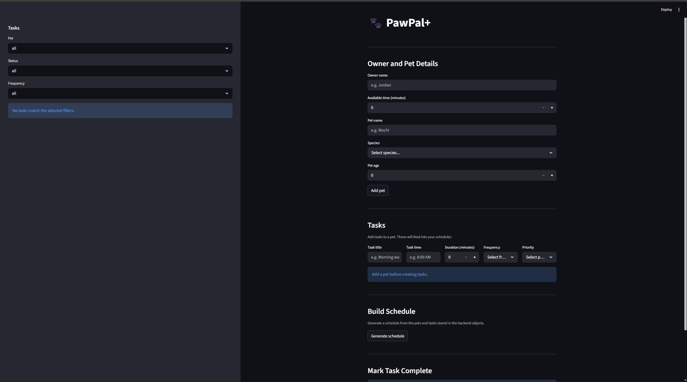

# PawPal+ (Module 2 Project)

**PawPal+** is a Streamlit pet care planner that helps a pet owner organize daily tasks, generate a smart schedule, and review care activity for multiple pets in one place.

## Scenario

A busy pet owner needs help staying consistent with pet care. They want an assistant that can:

- Track pet care tasks (walks, feeding, meds, enrichment, grooming, etc.)
- Consider constraints (time available and priority)
- Produce a daily plan and explain why it chose that plan

Your job is to design the system first (UML), then implement the logic in Python, then connect it to the Streamlit UI.

## Features

- Add owner, pet, and task details through a simple Streamlit workflow.
- Generate a daily schedule using task priority and the owner's available time.
- Display the generated schedule in time order for easier day-of execution.
- Filter tasks in the sidebar by pet, completion status, and frequency.
- Mark tasks complete and automatically refresh the schedule.
- Support recurring daily and weekly tasks by creating the next task instance on completion.
- Detect schedule conflicts and warn the user when multiple tasks overlap.
- Allow shared same-species walk/feed tasks without raising unnecessary conflict warnings.

## Demo

Add a final Streamlit screenshot here.




## Getting started

### Setup

```bash
uv sync
```

Run the Streamlit app with:

```bash
uv run streamlit run app.py
```

### Suggested workflow

1. Read the scenario carefully and identify requirements and edge cases.
2. Draft a UML diagram (classes, attributes, methods, relationships).
3. Convert UML into Python class stubs (no logic yet).
4. Implement scheduling logic in small increments.
5. Add tests to verify key behaviors.
6. Connect your logic to the Streamlit UI in `app.py`.
7. Refine UML so it matches what you actually built.

## Testing PawPal+

Run the current test suite with:

```bash
uv run pytest tests/test_pawpal.py
```

The tests currently cover core backend behaviors: marking tasks complete, adding tasks to pets, returning tasks in chronological order, building a daily schedule from overdue and due-today incomplete tasks, creating the next daily recurring task, detecting scheduling conflicts, and allowing valid shared walk/feed tasks for pets of the same species.

Current reliability confidence: `4/5`. The main scheduling rules are covered, but the project still has a small student-project test surface and could use more edge-case coverage over time.
